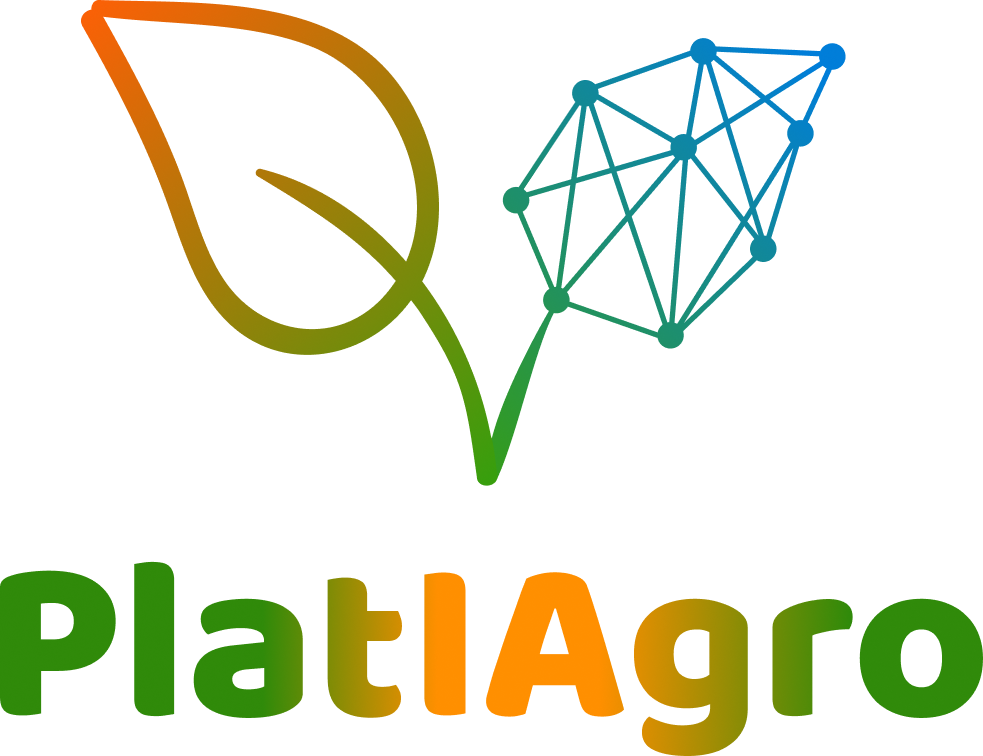

AI Platform for pushing Ag-Tech forward.

---

Visit [our website](https://www.cpqd.com.br/inovacao/platiagro/) and [docs](https://platiagro.github.io/) to learn about this project.

---

## Installing PlatIAgro on an existing Kubernetes cluster

Ensure that you have a [Kubernetes Cluster](https://kubernetes.io/docs/setup/), [kubectl](https://kubernetes.io/docs/tasks/tools/install-kubectl/#install-kubectl), and [kfctl](https://www.kubeflow.org/docs/started/getting-started/#installing-command-line-tools) configured for running commands against the Kubernetes cluster.

**NOTE: As of today, Kubernetes versions 1.14 and 1.15 are supported.**

Run the following commands:

```shell
export KF_NAME=platiagro
export BASE_DIR=$(pwd)
export KF_DIR=${BASE_DIR}/${KF_NAME}
export CONFIG_URI="https://raw.githubusercontent.com/platiagro/manifests/v0.1.0-kubeflow-v1.0-branch/kfdef/kfctl_platiagro_tls.v0.1.0.yaml"
mkdir -p ${KF_DIR}
cd ${KF_DIR}
kfctl apply -V -f ${CONFIG_URI}
```

Then visit http://[LOAD-BALANCER-HOST]/

## One-click installation on Google Kubernetes Engine (GKE)

Visit https://platiagro-gcp.herokuapp.com/ and follow the instructions.

## Useful Guides

- [Create a Kubernetes cluster on Ubuntu 18.04](https://github.com/platiagro/platiagro/blob/master/INSTALLATION.md)
- [Virtualization with kvm and libvirt](https://github.com/platiagro/platiagro/blob/master/VIRTUALIZATION.md)
