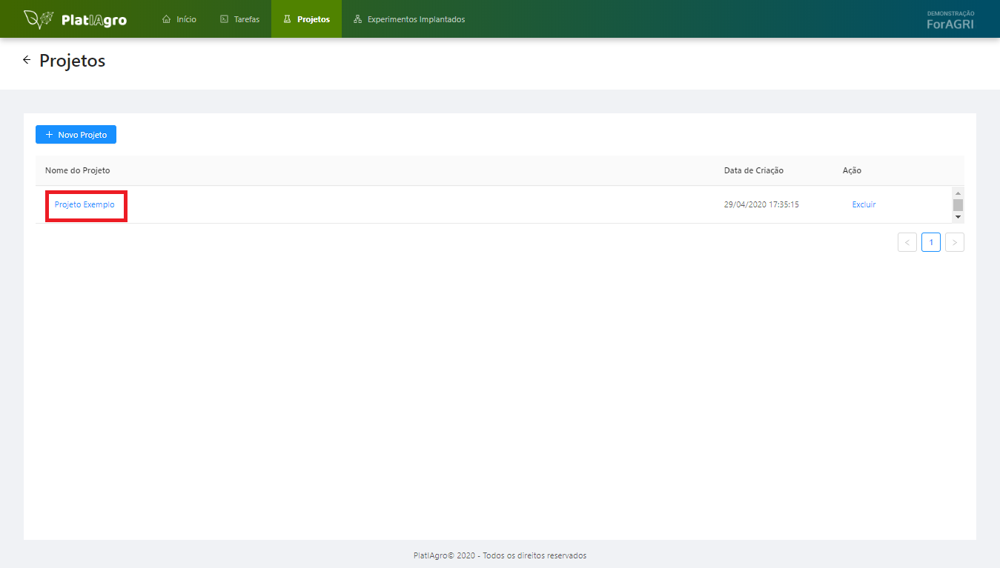
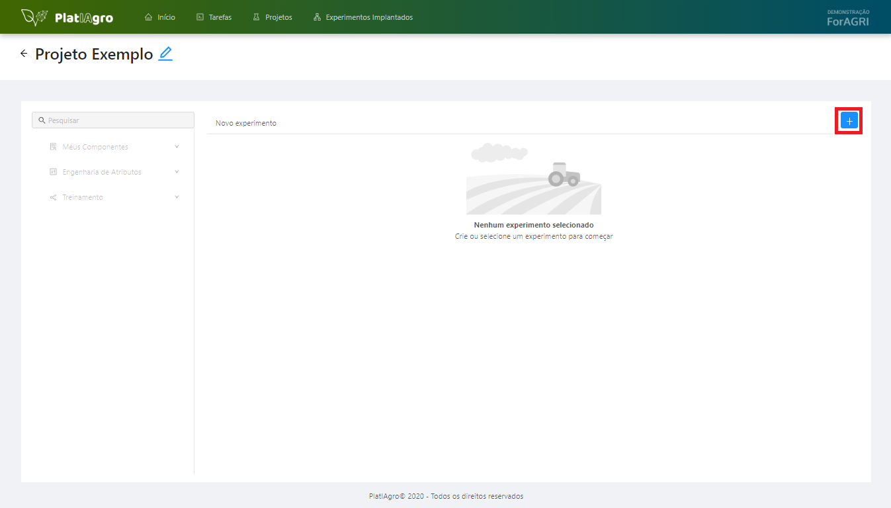

author:            Fabio Beranizo Lopes
summary:           Kubeflow AIops
id:                kubeflow-aiops-aifest2019
categories:        cloud
status:            draft
feedback link:     github.com/fberanizo/kubeflow-aiops-workshop

# Tutorial de utilização da plataforma

## Overview

[TODO]

## Listar tarefas

1. Clique na aba **Tarefas** do menu.

2. O usuário será redirecionado para a página das tarefas, onde será listado todas as tarefas existentes.

## Criar nova tarefa

1. Clique na aba **Tarefas** do menu.

2. Clique no botão **Nova Tarefa**.

3. Será aberto um modal.

4. Após escolher como deseja criar a tarefa, clique no botão **Criar Notebooks**.

5. Será aberto uma nova aba no navegador contento os Notebooks criados na tarefa.

## Editar tarefa

1. Clique na aba **Tarefas** do menu.

2. O usuário será redirecionado para a página das tarefas, onde será listado todas as tarefas existentes.

3. Selecione qual tarefa deseja editar, clicando no nome da tarefa.

4. Será aberto uma nova aba no navegador contento os Notebooks da tarefa selecionada para edição.

## Listar projetos

1. Clique na aba **Projetos** do menu.

2. O usuário será redirecionado para a página dos projetos, onde será listado todas os projetos existentes.

## Criar novo projeto

1. Clique na aba **Projetos** do menu

2. Clique no botão **Novo Projeto**

3. Será aberto um modal

4. Escolha um nome para o projeto e clique no botão **Criar**

5. O usuário será redirecionado para a página de experimentos do projeto

## Listar experimentos

1. Clique na aba **Projetos** do menu

2. O usuário será redirecionado para a página dos projetos, onde será listado todas os projetos existentes

3. Selecione qual projeto deseja listar os experimentos, clicando no nome do projeto

4. O usuário será redirecionado para a página de experimentos do projeto selecionado

## Criar novo experimento

1. Clique na aba **Projetos** do menu

2. O usuário será redirecionado para a página dos projetos, onde será listado todas os projetos existentes

3. Selecione qual projeto deseja criar um novo experimento, clicando no nome do projeto

4. O usuário será redirecionado para a página de experimentos do projeto selecionado

5. Clique no botão **+**

6. Será aberto um modal

7. Escolha um nome para o experimento e clique no botão **Criar**

## Montar fluxo de experimento

1. Clique na aba **Projetos** do menu.

2. O usuário será redirecionado para a página dos projetos, onde será listado todas os projetos existentes.

3. Selecione o projeto desejado, clicando no nome do projeto.

4. O usuário será redirecionado para a página de experimentos do projeto selecionado.

5. Selecione um experimento, clicando no nome do experimento.

6. Após selecionado o experimento, o usuário estará habilitado para a montagem do fluxo.

7. Para monta o fluxo, basta clicar nas tarefas desejadas.

8. Após clicar em uma tarefa, ela é adicionada automaticamente no fluxo.

### Remover tarefa do fluxo

1. Para remover uma tarefa do fluxo, basta clicar com o botão direito do mouse na tarefa desejada.

2. Clique em **Remover**.

### Dicas para montagem do fluxo
* Se o seu "alvo" é "Categorical", tem que terminar com um "Classifier" ou Logistic Regression.
* Se o seu "alvo" é "Numerical", tem que terminar com um "Regression",menos o Logistic Regression.

## Executar experimento

## Implantar um experimento

[TODO]

## Listar experimentos implantados

[TODO]

## Monitoramento de experimentos implantados

[TODO]

## Testar inferência de experimentos implantados

[TODO]
